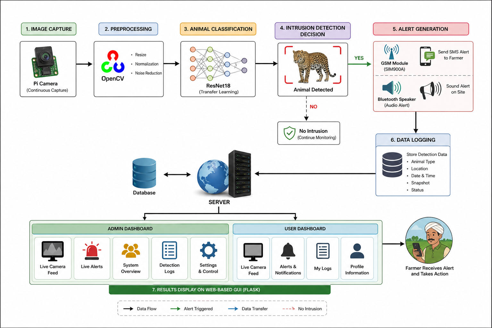
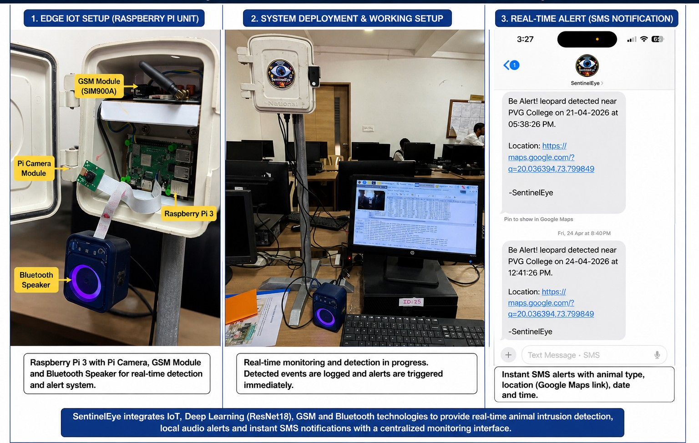
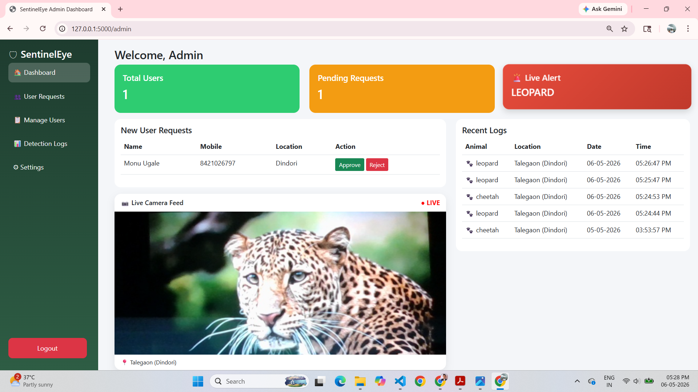
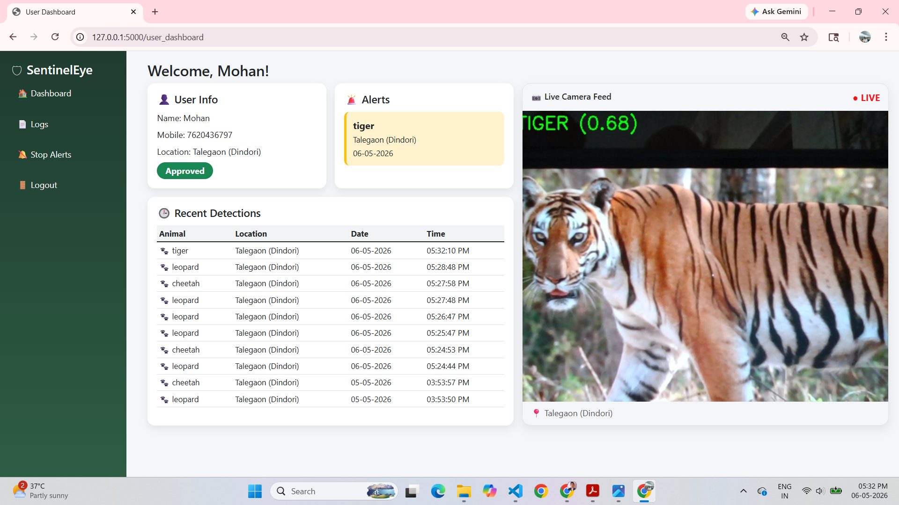
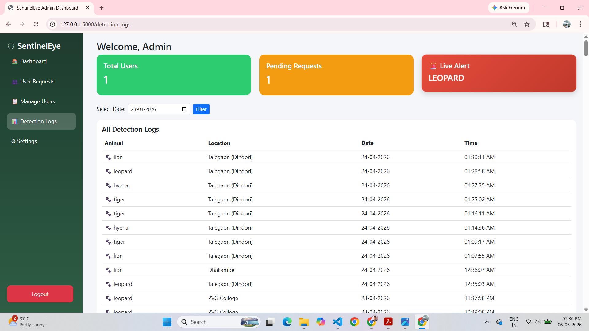

# 🐆 SentinelEye: ML-Based Wild Animal Intrusion Detection System Using Raspberry Pi

An intelligent AI-powered surveillance system designed to detect wild animals in real time using **Deep Learning** and **Computer Vision** on a **Raspberry Pi 5**. The system helps reduce human–wildlife conflicts by identifying animals near farms, villages, and public areas and generating timely alerts.

---

## 📖 Project Overview

Human–wildlife conflict has become a significant concern in many rural and forest-border regions. SentinelEye is designed to provide an automated monitoring solution that continuously observes the surroundings using a camera and detects wild animals using a Deep Learning model.

When an animal is detected, the system captures the event, identifies the animal species, and generates alerts to help prevent potential accidents and crop damage.

---

## ✨ Key Features

- 🧠 AI-based Wild Animal Detection
- 🎥 Real-Time Camera Monitoring
- 🐆 Detects Multiple Wild Animal Species
- ⚡ Raspberry Pi 5 Edge Deployment
- 📸 Automatic Image Capture
- 🔊 Local Audio Alert
- 📩 SMS Alert using GSM Module
- 📋 Detection Log Generation
- 🌐 Flask-based Web Dashboard
- 💾 Lightweight Edge AI Solution

---

## 🛠️ Technologies Used

### Programming Languages

- Python

### Machine Learning & Computer Vision

- PyTorch
- TorchVision
- ResNet18
- OpenCV
- NumPy
- Pillow

### Hardware

- Raspberry Pi 5 (4GB)
- Raspberry Pi Camera Module
- GSM Module (SIM900A)
- Buzzer
- Speaker
- Power Supply

### Web Technologies

- Flask
- HTML
- CSS
- JavaScript

---

## 🏗️ System Architecture

<p align="center">

</p>

---

## 🔄 Workflow

```text
Camera
   │
   ▼
Capture Live Frames
   │
   ▼
Image Preprocessing
   │
   ▼
ResNet18 Model
   │
   ▼
Animal Classification
   │
   ▼
Animal Detected?
      │
 ┌────┴────┐
 │         │
 ▼         ▼
Save Image  Activate Buzzer
 │
 ▼
Send SMS using GSM
 │
 ▼
Update Detection Logs
 │
 ▼
Display on Flask Dashboard
```

---

## 📸 Project Gallery

### Hardware Setup

<p align="center">

</p>

---

### Detection Output

<p align="center">

</p>

---

### Web Dashboard

<p align="center">

</p>

<p align="center">

</p>


---

## 🧠 Machine Learning Pipeline

- Image Acquisition
- Image Preprocessing
- ResNet18 Inference
- Confidence Evaluation
- Target Animal Filtering
- Alert Generation
- Event Logging

---

## 🎯 Target Animal Classes

- Leopard
- Tiger
- Wild Boar
- Hyena
- Elephant *(Optional)*
- Bear *(Optional)*

---

## 📂 Repository Structure

```text
SentinelEye
│
├── README.md
├── LICENSE
├── requirements.txt
│
├── Images/
│   ├── Hardware_Setup.jpg
│   ├── System_Architecture.png
│   ├── Dashboard.png
│   ├── Detection_Output.png
│   ├── Flowchart.png
│   └── Block_Diagram.png
│
├── Documentation/
│   └── Presentation.pdf
│
├── Demo/
│   └── SentinelEye_Demo.mp4
│
└── Sample_Code/
    ├── animal_detection_demo.py
    └── README.md
```

---

## 📦 Installation

Clone the repository

```bash
git clone https://github.com/yourusername/SentinelEye.git
```

Install dependencies

```bash
pip install -r requirements.txt
```

Run the demo

```bash
python Sample_Code/animal_detection_demo.py
```

---

## 📊 Applications

- Agricultural Farms
- Forest Border Areas
- Villages Near Wildlife Sanctuaries
- Highways Passing Through Forests
- Schools and Colleges Near Forest Regions
- Wildlife Monitoring

---

## 🚀 Future Enhancements

- YOLOv11-based Detection
- Thermal Camera Integration
- Mobile Application
- Cloud Dashboard
- GPS Tracking
- Solar Powered Deployment
- Edge TPU Acceleration
- Telegram/WhatsApp Alerts

---

## 🔒 Source Code Availability

This repository contains project documentation, architecture diagrams, demonstration media, and a simplified animal detection example.

The complete implementation is **not publicly available**, as it includes proprietary software modules and hardware integration developed as part of the project.

The following components are intentionally excluded:

- Complete Raspberry Pi deployment code
- Flask application source
- GSM communication module
- GPIO control logic
- Detection logging system
- Configuration files
- Trained model files
- Project-specific datasets

If you would like to discuss the project implementation or architecture, feel free to contact me.

---

## 👨‍💻 Author

**Mohan Ugale**

Artificial Intelligence & Data Science Engineer

📧 **Email:** mohanugale.tech@gmail.com

💼 **LinkedIn:** https://linkedin.com/in/mohan-ugale

---

## ⭐ Support

If you found this project interesting, please consider giving it a **⭐ Star**.
